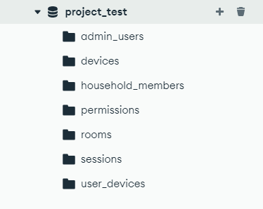

# f29pdfinal

Currently the app loads onto the dashboard since the backend is not connected fully to check the login and sign up add auth/login and auth/signup to url to check the login and sign up. 


Step 1: Database

Make sure local Mongo DB connection has the following collections <br />


Step 2: Backend

Open a new terminal
>cd backend <br />
>python -m venv myenv <br />
> myenv/Scripts/activate <br />
>pip install -r requirements.txt <br />
> if pip needs to be upgraded do it otherwise the code wont work <br />
>uvicorn main:app --reload <br />

Step 3: Environment Setup

Create a `.env.local` file in the root directory with the following content:
```
NEXT_PUBLIC_API_URL=http://localhost:8000
OPENWEATHER_API_KEY=your_openweathermap_api_key_here
```

You'll need to sign up for a free API key at [OpenWeatherMap](https://openweathermap.org/api) to enable the weather widget on the dashboard.

Step 4: Frontend

Open a new terminal
>npm install <br />
>npm run build <br />
>npm install tailwindcss <br /> (IMPORTANT)
>npm run dev <br />

things to be done --

``-connect to backend ``
``-edit the css/styles``


